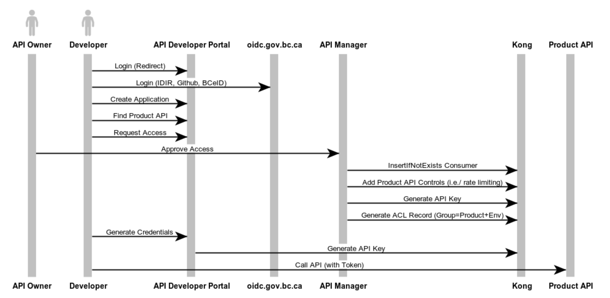

# Process Flows

## Onboarding a new API

The USER-JOURNEY.md documentation under `gwa-api` provides the steps required to configure the Gateway and make the API available for discovery.

[new-api websequencediagram](new-api.md)

## Support Authentication Flows

### API Key w/ ACL

### Anonymous Client Registration (auto issuing)

In this scenario, the APS Portal requires the `manage-clients` role in the Realm of the particular OIDC Provider.

### Others

* OIDC with Anonymous Client Registration (manage-clients) (auto enable) - API Portal has `manage-clients`
* OIDC with Anonymous Client Registration (manually enable) - API Portal has no authorization
* OIDC with Managed Client Registration (manage-clients) (auto enable) - API Portal has `manage-clients`
* OIDC with Managed Client Registration (create-client) (manually enable) - API Portal has `create-client`
* OIDC with IAT Client Registration - API Portal has limited `create-client` permissions

