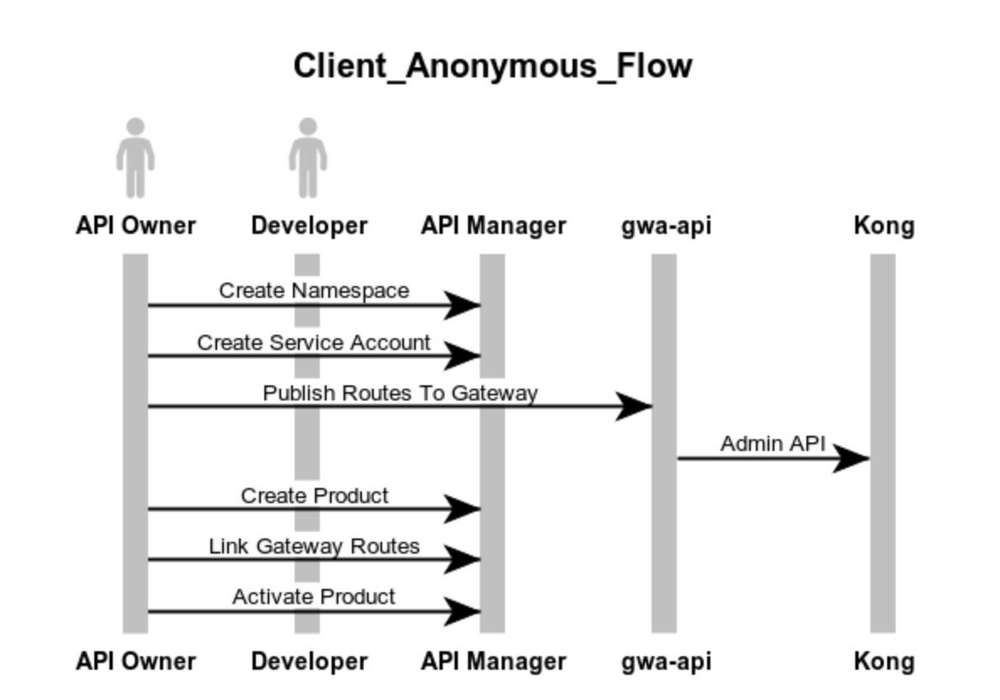

# Onboarding a new API

The USER-JOURNEY.md documentation under `gwa-api` provides the steps required to configure the Gateway and make the API available for discovery.




**websequencediagrams.com**

```
title Onboarding

actor API Owner
actor Developer
API Owner -> API Manager : Create Namespace
API Owner -> API Manager : Create Service Account
API Owner -> gwa-api : Publish Routes To Gateway
gwa-api -> Kong : Admin API
API Owner -> API Manager : Create Product
API Owner -> API Manager : Link Gateway Routes
API Owner -> API Manager : Activate Product
```
