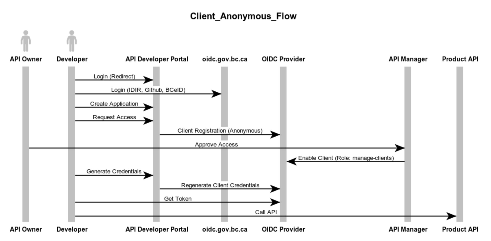

# OIDC Anonymous Client Registration Flow

If the OIDC Provider allows for Anonymous Client Registration and a Client that has `manage-clients` rights on the Realm.




**websequencediagrams.com**

```
title Client_Anonymous_Flow

actor API Owner
actor Developer
#API Owner -> API Manager : Create Namespace
#API Owner -> API Manager : Create Service Account
#API Owner -> gwa-api : Publish Routes To Gateway
#gwa-api -> Kong : Admin API
#API Owner -> API Manager : Create Product
#API Owner -> API Manager : Link Gateway Routes
#API Owner -> API Manager : Activate Product
Developer -> API Developer Portal : Login (Redirect)
Developer -> oidc.gov.bc.ca : Login (IDIR, Github, BCeID)
Developer -> API Developer Portal : Create Application
Developer -> API Developer Portal : Request Access
API Developer Portal -> OIDC Provider : Client Registration (Anonymous)
API Owner -> API Manager : Approve Access
API Manager -> OIDC Provider : Enable Client (Role: manage-clients)
Developer -> API Developer Portal : Generate Credentials
API Developer Portal -> OIDC Provider : Regenerate Client Credentials
Developer -> OIDC Provider : Get Token
Developer -> Product API : Call API
```
