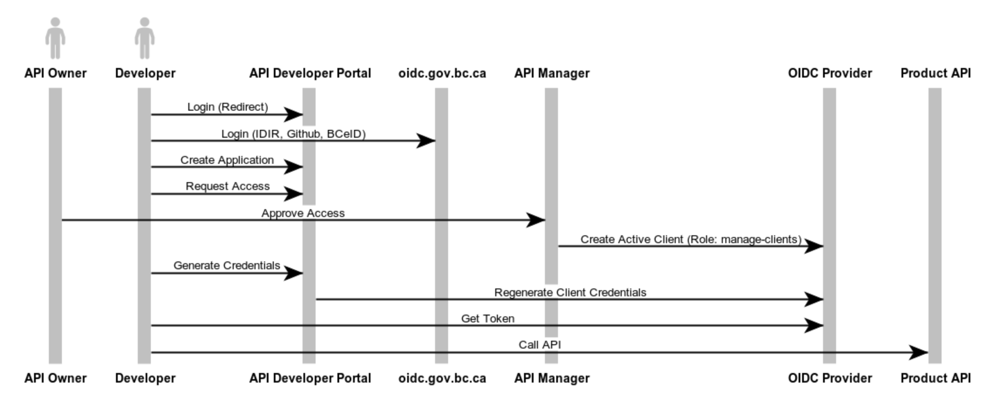

# OIDC Managed Client Registration Flow

If the OIDC Provider provides a Client that has `create-clients` and `manage-clients` rights on the Realm.



**websequencediagrams.com**

```
title ""

actor API Owner
actor Developer
Developer -> API Developer Portal : Login (Redirect)
Developer -> oidc.gov.bc.ca : Login (IDIR, Github, BCeID)
Developer -> API Developer Portal : Create Application
Developer -> API Developer Portal : Request Access
API Owner -> API Manager : Approve Access
API Manager -> OIDC Provider : Create Active Client (Role: manage-clients)
Developer -> API Developer Portal : Generate Credentials
API Developer Portal -> OIDC Provider : Regenerate Client Credentials
Developer -> OIDC Provider : Get Token
Developer -> Product API : Call API
```
